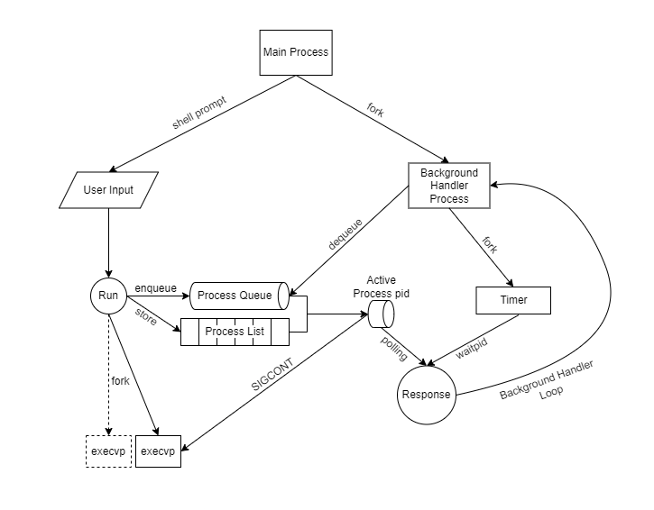

# Introduction
The aim of this project is build a custom shell with the use of System Call APIs with `C programming`


# Dependencies

If you wish to compile the script from source, you will need the following:
1. A Linux Based System (OS)
    - This script was built on Ubuntu 22.04.1 LTS in WSL2, there is no guaranteed support on other systems
2. [gcc (Compiler)](https://gcc.gnu.org/install/index.html)
    - If you wish to compile the source codes, you will need gcc to do so
    - Alternatively, a precompiled binary `shell` is also provided if you do not wish to compile from source

# Usage

## Configuring the Custom Shell (Optional)

Before you compile and run the shell, you may want to change some of the following configurations:
```c
/******************************************************************************
 * Configs
 ******************************************************************************/

enum {
  MAX_PROCESSES = 64, // change this to change the maximum allowed processes at one time
  MAX_RUNTIME = 5, // change this to change the maximum runtime
};
```
## Compiling and Running the Custom Shell (Optional)
If you wish to compile the codes, you may use the `run_shell.sh` script provided.

Take note that you may also need to make the file executable with the `chmod` command.
```bash
# make run_shell.sh executable 
chmod +x run_shell.sh
# execute run_shell.sh
./run_shell.sh
```

## Running the Custom Shell without Compiling
Alternatively, if you do not wish to compile the source code, a precompiled binary, `shell` has been provided at the root of the project for use:
```bash
# make shell binary executable 
chmod +x shell
# execute the shell binary
./shell
```

## System Design
There are 3 main components to the shell.



1. Main Process
    - Handles the user's inputs from the shell prompt
2. Background Handler Process
    - Handles the scheduling of jobs in a round robin manner
3. Timer Process
    - A process that sleeps for `MAX_RUNTIME` seconds and returns

Upon running the shell, the `Main Process` forks a `Background Handler Process` and starts listening for user inputs from the shell prompt.

An empty `Process List` and a `Process Queue` is first created. 
The `Process List` is used to track the different processes created and their `states`.
The `Process Queue` is used to keep track of which process is to be executed at the moment.

When a user inputs a `run` command, the `Main Process` parses this command and forks a child to execute the command with `execvp`. 
However, before running `execvp`, the forked child will run `raise(SIGSTOP)` to stop itself from executing any futher. 
The purpose of this is to make it so the `Background Handler` is the only process capable starting any new processes to ensure they only run for `MAX_RUNTIME` seconds.

The `Background Handler Process` will then try to `dequeue` the next process in to be executed and resume it with the `SIGCONT` signal. Besides resuming the `Next Processes`, it also forks a `Timer Process` that runs for exactly `MAX_RUNTIME` seconds which is by default `5` seconds. While these two processes are running, the `Background Handler Process` waits for any of the following conditons:
1. The `Next Process` returns before the `Timer Process`
    - We know the process has completed in less than `5` seconds, which means it has finished running.
    - In this case we will continue to the next process in the `Process Queue`
2. The `Timer Process` returns before the `next process`
    - We know the process has yet to complete and has used up all its `5` seconds of allocated time. 
    - In this case, we will queue this process to the end of the `Process Queue` again as it has not finished.
3. The `Next Process` status is no longer `RUNNING`
    - This means the user has use a command like `kill` or `stop` and has interrupted the process's running
    - In this case we will continue to the next process in the `Process Queue`


